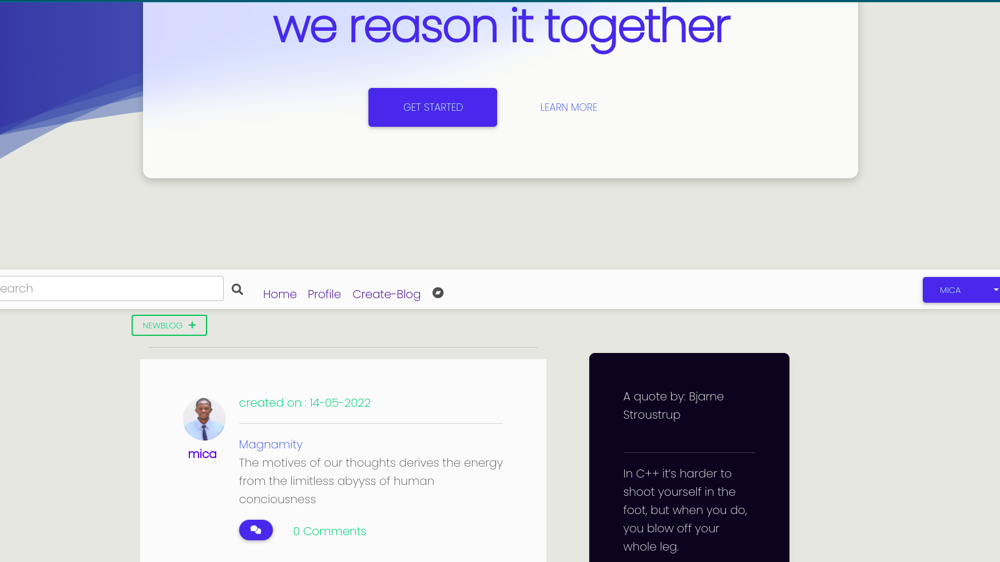

# Portfolio
##### MICHAEL OGAYE
### Camiblog
## Table of Content
+ [Description](#description)
+ [Installation Requirement]( Requisites)
+ [Technology Used](technology-used)
+ [Reference](#reference)
+ [Licence](#licence)
+ [Authors Info](#aut)
## Description

Camiblog,is search a unique application that lets users to share their thoughts through blogging, and even making new comments to other users blogs

## Screenshot

## set-up
### Vitals
* A stable computer,whith proven working capacity
* Internet connectivity to keep on committing your work to the github repo
* An Heroku account to deploy the project
* Postgres Database both locally and heroku
### Installation Process
* The project is done in git initialized environment to enable one keep on saving his work on a remote repo
## Technology Used
* Python
* flask
* heroku
* Postgresql

  
[Go Back to the top](#portfolio)
## Licence
[MIT License](./LICENSE)
Copyright (c) [2022] [Michael Ogaye]

[Go Back to the top](#portfolio)
## Authors Info
Slack Profile - Michael Ogaye

Linkedln - [Michael Ogaye](https://www.linkedin.com/in/ogaye-michael-279342212/)

Email: hogaeymic@gmail.com

[Go Back to the top](#portfolio)